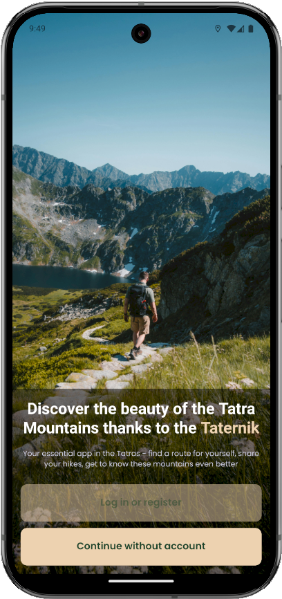
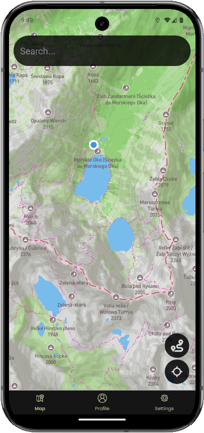
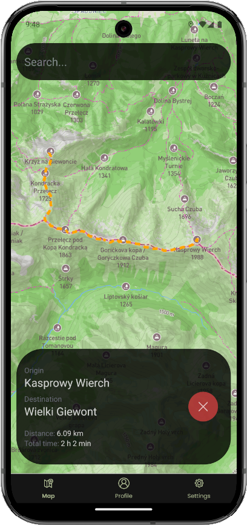

# Taternik

*A mobile application developed in React Native, designed to enhance the planning and execution of mountain trips.*

  
  
  

## System Requirements
- **Operating System**: Android 8.0 or higher
- **Processor**: 64-bit, at least 1.8 GHz
- **RAM**: 2 GB or more
- **Storage**: At least 200 MB of free space

## Installation and Setup
1. Find the `Taternik.apk` file located in the `UJ project` folder.
2. Copy the file to your mobile device.
3. Install the app by following the on-screen instructions.
4. Before launching the app, grant it precise location permissions.

The application is still in the early stages of development, so it is not yet available in the official store. The author assures about the security of the .apk file provided by him.

## User Interface
### Introductory Screen
- **Log In or Sign Up Button**: Navigates to **Login** and **Registration** screen
- **Continue Without Account Button**: Navigates to the **Map** screen.

### Home Screen Tabs
- **Map**: The main feature for route planning.
- **Profile**: Displays user information and achievements *(in development)*.
- **Settings**: Access to documentation and customer support *(in development)*.

## Key Features
### Searching for a Point
1. On the **Map** screen, tap the search bar at the top of the screen.
2. Start typing the name of the desired point.
3. Tap the selected name from the displayed results.

### Searching for a Route
1. On the **Map** screen, tap the second icon from the list of available round icons on the right side of the screen.
2. Fill in both search fields by typing and selecting the appropriate points.
3. Press the **Search** button.

### Centering to the user's location (if it is in the Tatra Mountains)
1. On the **Map** screen, tap the first icon from the list of available round icons on the right side of the screen.

## Troubleshooting
### Issue: The app won't open
- **Solution**: Ensure that you have granted location permissions.

### Issue: The map isn't displaying
- **Solution**: Check your internet connection and try again.

### Issue: The user's location is not visible, the view cannot be centered around it.
- **Solution**: Make sure you have granted location permissions, it is running and you are in the Tatra Mountains